<h1>
  <span class="headline">Building Your First React App</span>
  <span class="subhead">Common Errors in React</span>
</h1>

**Learning objective:** By the end of this lesson, students will be able to recognize and fix common setup and JSX errors.

# Common Errors in React

Errors are a normal part of building a React app. Read the error message and check the terminal, browser, and browser console for more information.

### The development server is not running

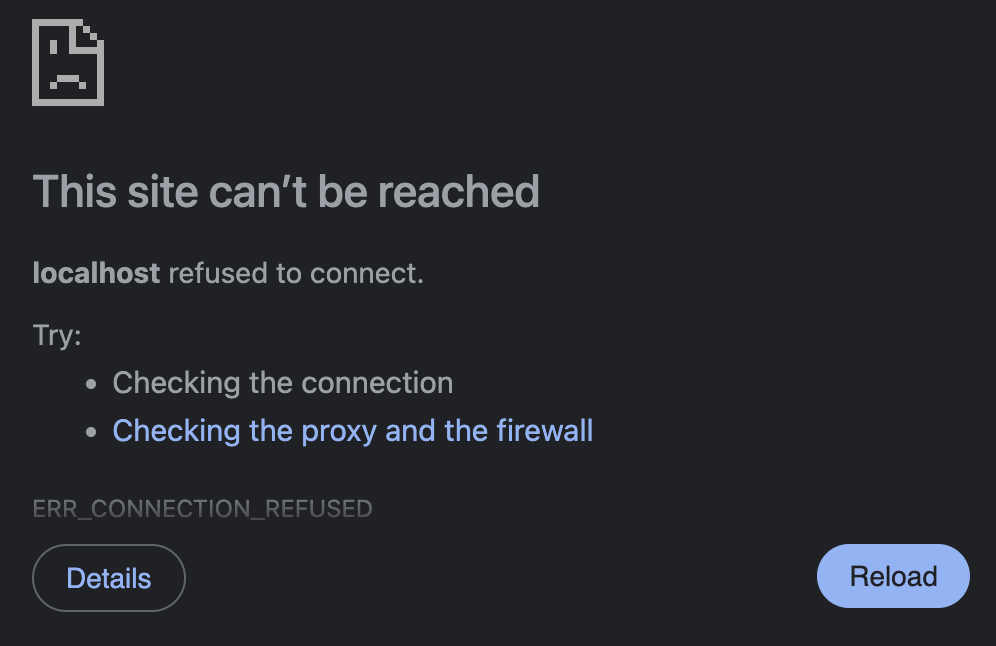

If the browser cannot open your app, make sure the development server is running:

```bash
npm run dev
```

Run this command from inside your React project folder.

Keep this terminal open while working on the app.

### Running the command from the wrong folder

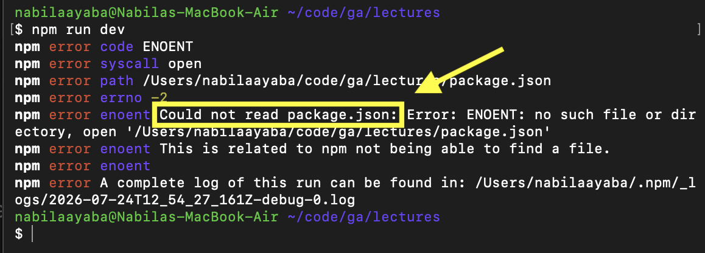

If you see an error about a missing `package.json`, you may be in the wrong directory.

Check your current folder:

```bash
pwd
```

List its contents:

```bash
ls
```

You should see files such as:

```text
package.json
src
index.html
vite.config.js
```

### Returning more than one element

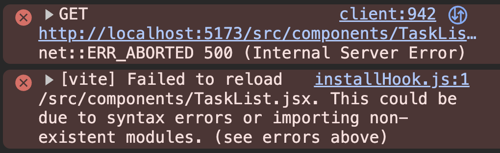
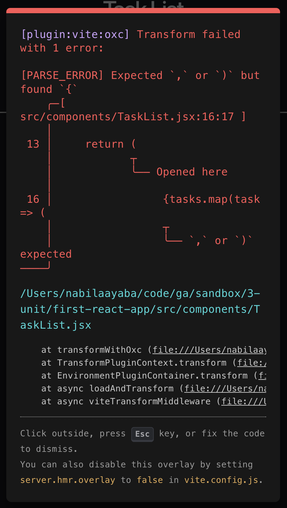

A component must return one parent element.

This will cause an error:

```jsx
const App = () => {
  return (
    <h1>Hello, world!</h1>
    <p>Welcome to React</p>
  )
}
```

Wrap the elements in a Fragment:

```jsx
const App = () => {
  return (
    <>
      <h1>Hello, world!</h1>
      <p>Welcome to React</p>
    </>
  )
}
```

### A tag is not closed


Every JSX tag must be closed.

Incorrect:

```jsx

```

Correct:

```jsx

```

Elements with content need an opening and closing tag:

```jsx
<h1>Hello, world!</h1>
```

### The component name is lowercase

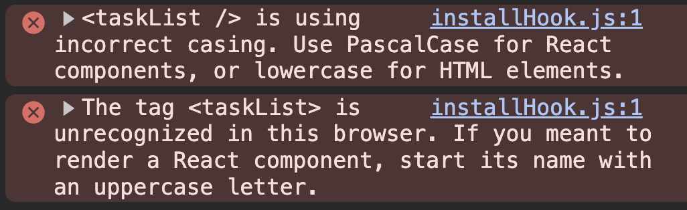

React component names must begin with a capital letter.

Incorrect:

```jsx
const app = () => {
  return <h1>Hello, world!</h1>
}

export default app
```

Correct:

```jsx
const App = () => {
  return <h1>Hello, world!</h1>
}

export default App
```

### The import path is incorrect

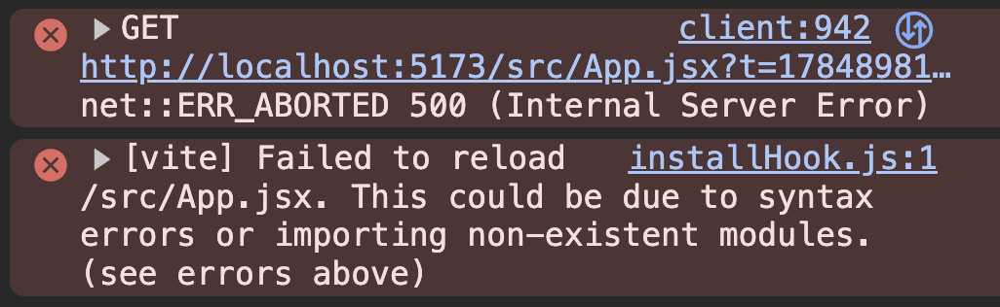
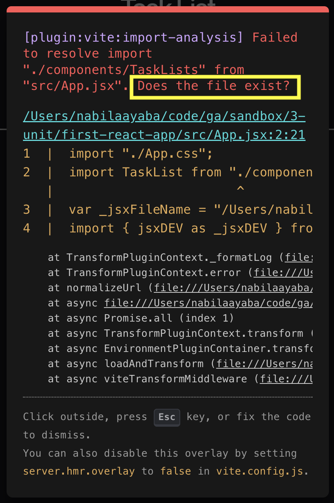

An import path must match the file’s location and spelling.

```jsx
import App from './App.jsx'
```

Check that:

* the file exists
* the spelling matches
* uppercase and lowercase letters match
* the path begins with `./` when importing a nearby file

For example, `App.jsx` and `app.jsx` may be treated as different filenames.

### The component was not exported

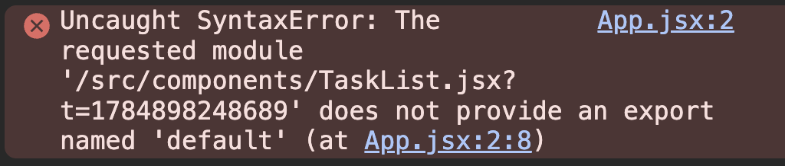

A component must be exported before another file can import it:

```jsx
const Task = () => {
  return <h1>Hello, world!</h1>
}

export default Task
```

Without `export default Task`, the import in `App.jsx` will fail.

### Using `class` instead of `className`

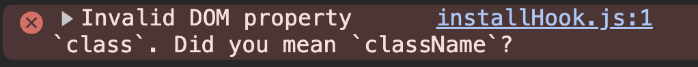

JSX uses `className` instead of `class`.

Incorrect:

```jsx
<h1 class="headline">Hello, world!</h1>
```

Correct:

```jsx
<h1 className="headline">Hello, world!</h1>
```


### Using curly braces without `return`

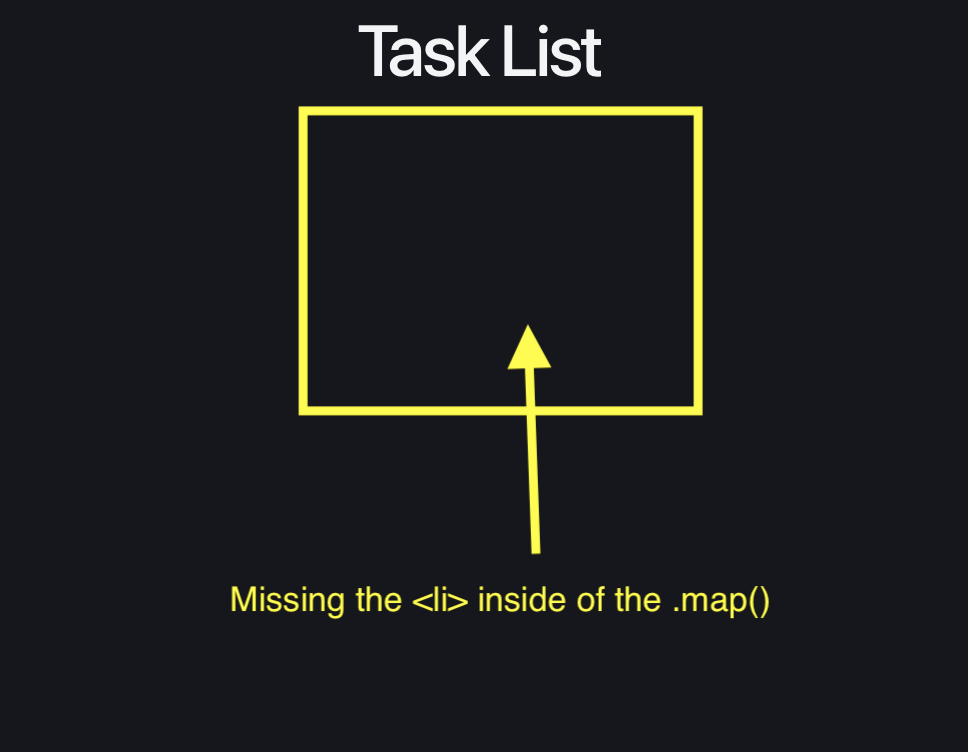

**Rather than see an error, you simply won't see what you're trying to display on the page.**

Arrow functions can use either parentheses or curly braces.

This often causes problems inside `.map()`.

Incorrect:

```jsx
{tasks.map((task) => {
  <li key={task.id}>{task.text}</li>
})}
```

Because the arrow function uses curly braces, it must include `return`.

Without `return`, the function returns nothing, so no list items appear.

Correct:

```jsx
{tasks.map((task) => {
  return (
    <li key={task.id}>{task.text}</li>
  )
})}
```

For shorter code, use parentheses instead of curly braces:

```jsx
{tasks.map((task) => (
  <li key={task.id}>{task.text}</li>
))}
```

The parentheses return the JSX automatically.

### Forgetting a `key`

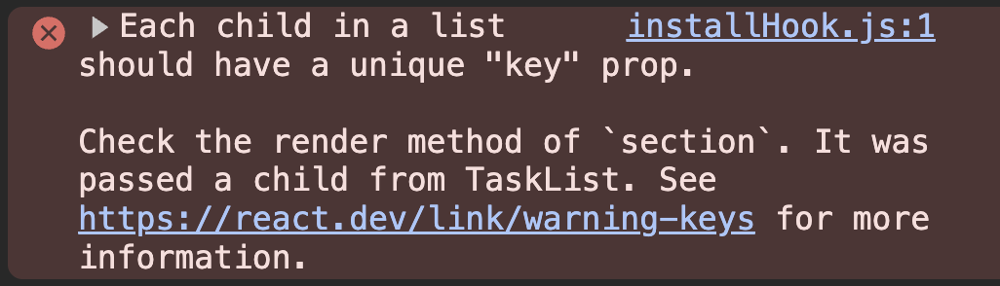

When using `.map()` to create JSX elements, each element needs a unique `key`.

Incorrect:

```jsx
{tasks.map((task) => (
  <li>{task.text}</li>
))}
```

The list may still appear, but React will show a warning in the browser console.

Correct:

```jsx
{tasks.map((task) => (
  <li key={task.id}>{task.text}</li>
))}
```

The `key` helps React keep track of each item in the list.

Use a unique value such as an ID whenever possible.


## Troubleshooting checklist

When something is not working, check:

1. Is the development server running?
2. Are you inside the correct project folder?
3. Is every JSX tag closed?
4. Is the component returning one parent element?
5. Does the component name begin with a capital letter?
6. Are the import path and filename correct?
7. Is the component exported?
8. Are you returning anything?
9. Does each item in `.map()` have a key?
