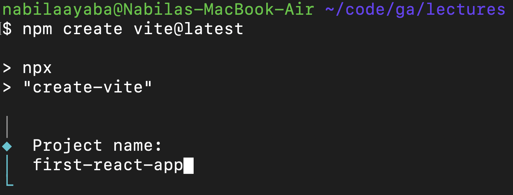
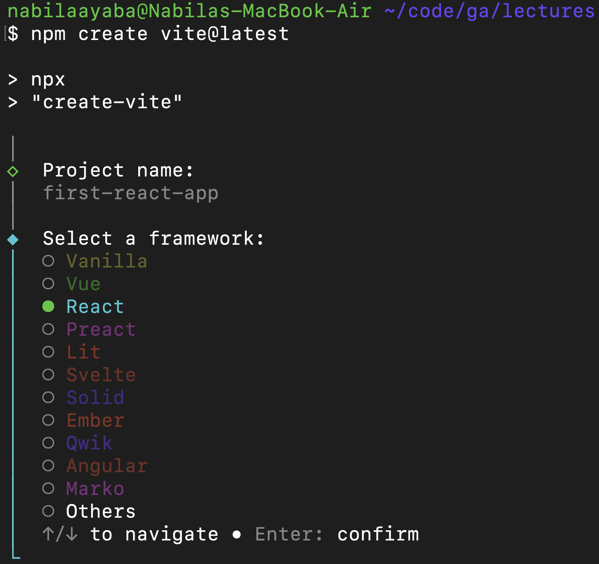
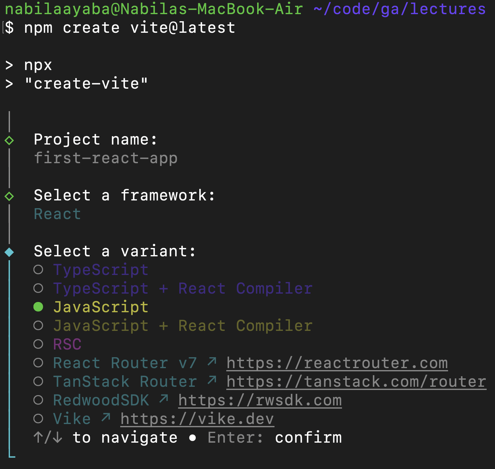
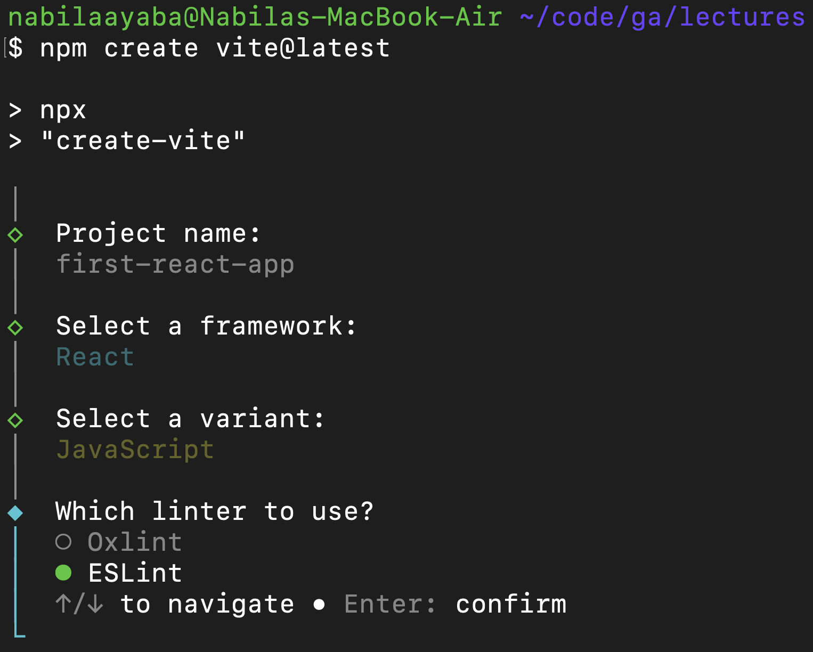
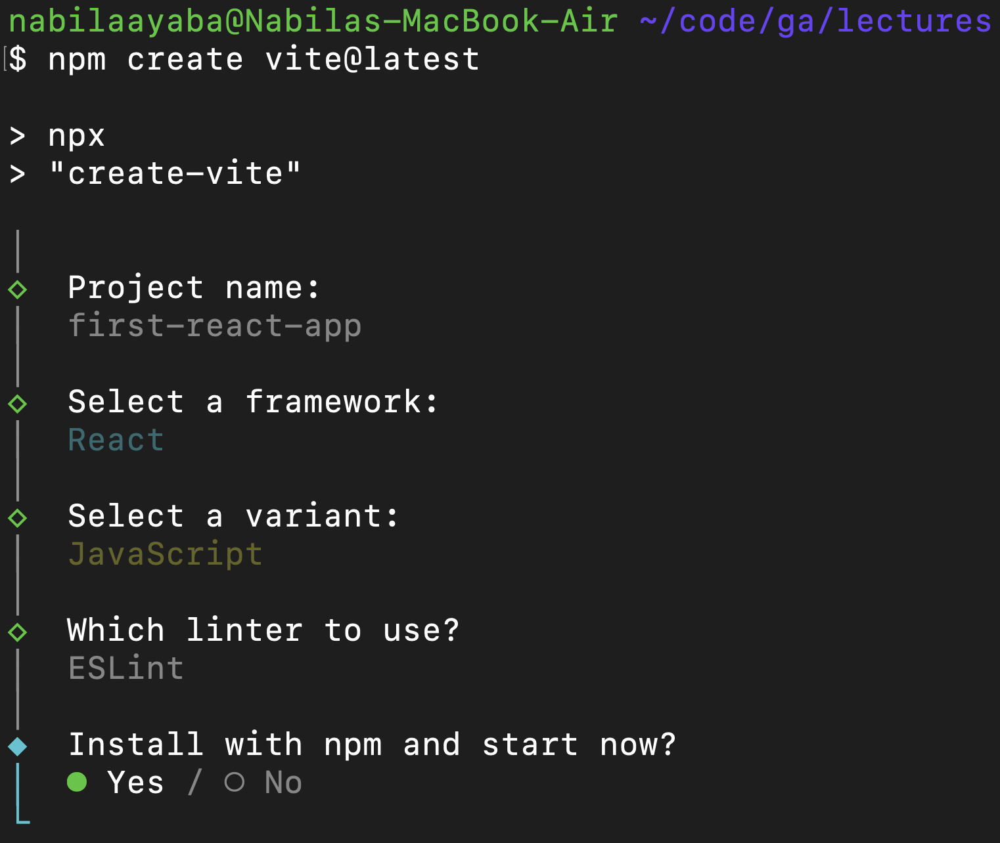
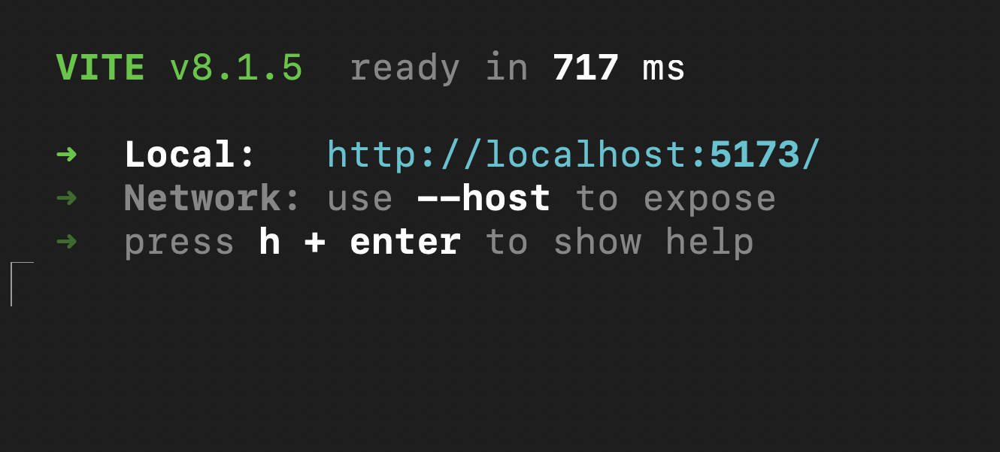
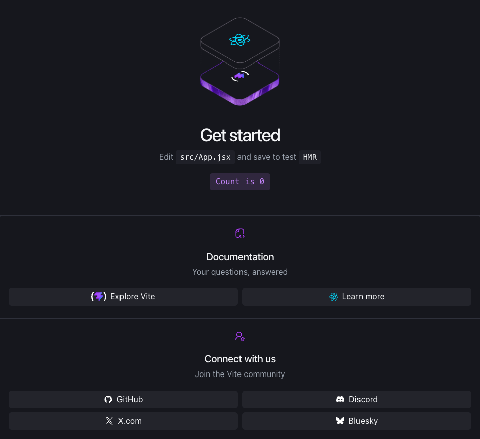

<h1>
  <span class="headline">Building Your First React App</span>
  <span class="subhead">Setup</span>
</h1>

## Setup

Open your Terminal application and navigate to your `~/code/ga/lectures` directory:

```bash
cd ~/code/ga/lectures
```

Next, run the following:

```bash
npm create vite@latest
```

You'll be prompted to provide a project name. `vite-project` is the default but when you start typing that default will go away. Choose a name that makes sense for this project; in this case, we'll call the app `first-react-app`.


Next, you'll select a framework. Use the arrow keys to choose the `React` option, and hit `Enter`.


Again, use the arrow keys to choose the `JavaScript` variant and hit `Enter`.


Select a linter. Again, use the arrow keys to choose `ESLint` and hit `Enter`.


The Vite installer will ask if you want to install with npm and start now? hit `Enter`


This will cause your server to immediately start running.



Navigate to [http://localhost:5173/](http://localhost:5173/) to see your new react app running!


Stop your server with `ctrl + c`

Move into the project you just created and launch the app in VS Code:

```bash
cd first-react-app
code .
```

Open the `App.jsx` file in the `src` directory and replace the contents of it with the following:

```jsx
// src/App.jsx
import './App.css'


const App = () => {

  return (
    <h1>Hello, world!</h1>
  )
}

export default App
```

Run your server again:

```bash
npm run dev
```